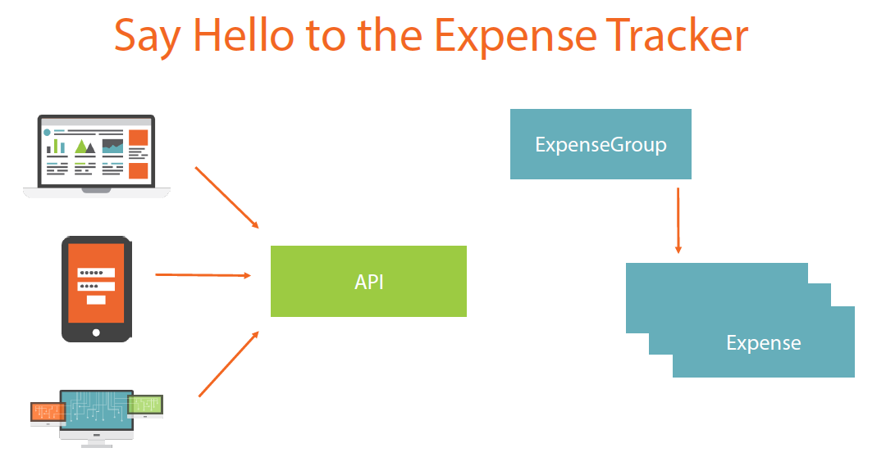
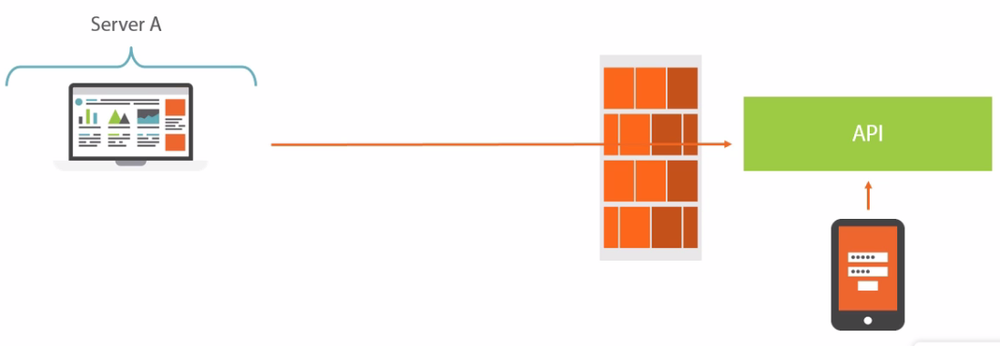

# [Pluralsight] Building and Securing a RESTful API for Multiple Clients in ASP.NET

[URL Course](https://app.pluralsight.com/library/courses/building-securing-restful-api-aspdotnet)

## Table Of Contents

1. Introduction
1. Building the API - REST and Web API Primer
1. Building the API – Implementing Basic Requirements
1. Building the API – Implementing Advanced Requirements
1. Deploying the API
1. Consuming the API
1. Security - From What Used to Work to What Works Today
1. Configuring and Deploying a Security Token Service
1. Securing the Client Applications (OAuth 2.0 and OpenID Connect)
1. Securing the API (OAuth 2.0 and OpenID Connect)

## Expense Tracker

An expense group then consists of a list of expenses. For example, your plane tickets, restaurant costs, etc.

## Gathering Requirements

### Technical, Functional, Environmental

- API needs to be consumable from different types of clients (standards!)
- API needs to be friendly to consume (uniform interface)
- API needs to support CRUD operations
- API needs to support sorting
- API needs to support paging
- API needs to support data shaping for associations
- A cross-platform authorization mechanism is required (OAuth2)
- An identification layer is required on top of that (OpenIDConnect)
- API needs to support filtering
- API needs to support data shaping for field-level selection
- API mustn't break when changes are rolled out

